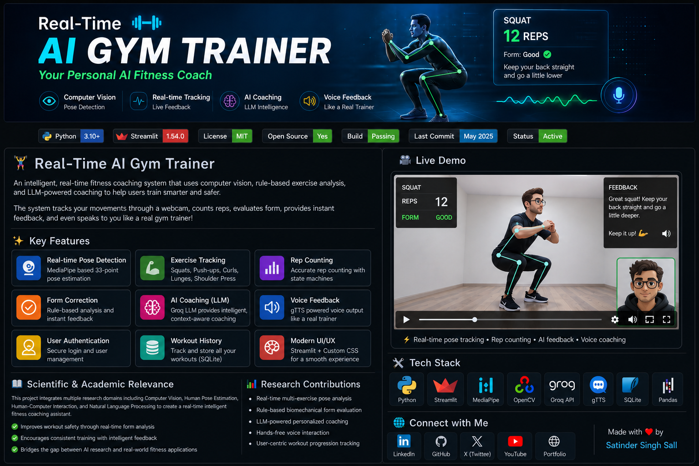

# 🧠 AI Gym Coach – Main Application

### ⚡ Real-time AI-powered workout tracking, form correction & voice coaching

---

<p align="center">
  
</p>

---

## 🧩 Overview

This is the **core AI application** powering the Real-Time AI Gym Trainer.

It combines:

- 📹 Real-time video processing
- 🧠 Pose detection (MediaPipe)
- 📊 Workout tracking
- 🗣️ AI voice coaching (LLM + TTS)
- 🗄️ Persistent workout storage

> This module is responsible for **all intelligence, tracking, and feedback loops**.

---

## ⚙️ Core Features

### 🧍‍♂️ Real-Time Pose Detection

- Uses MediaPipe Pose Landmarker
- Processes live webcam feed
- Extracts key body landmarks per frame

---

### 🔁 Exercise Detection & Rep Counting

Custom detectors for:

- Squats
- Push-ups
- Biceps Curls
- Shoulder Press
- Lunges

Each detector:

- Computes joint angles
- Tracks motion stages (up/down)
- Counts reps accurately

---

### 📏 Form Correction System

Detects:

- Improper depth
- Bad posture
- Imbalance
- Momentum misuse

Returns structured feedback like:

```json
{
  "depth_status": "TOO HIGH",
  "back_angle": 120
}
```

---

### 🗣️ AI Voice Coaching Pipeline

#### Flow:

```
Metrics → Issue Detection → LLM → TTS → Audio Playback
```

- LLM: Groq (LLaMA 3)
- TTS: gTTS
- Feedback types:
  - Workout start
  - Set completion
  - Form correction
  - Workout completion

---

### 📊 Workout Tracking & Persistence

Stored using SQLite:

- reps
- sets
- duration
- exercise type

Supports:

- Aggregation by day
- Multi-session tracking

---

### 🎛️ Streamlit UI

- Sidebar workout planner
- Live metrics dashboard
- Webcam stream with overlays
- Real-time feedback display

---

## 🏗️ Project Structure

```
Main App/
│
├── core/                # Base logic (angles, math utilities)
├── detectors/           # Exercise-specific logic
│
├── services/
│   ├── vision/          # Video + pose processing
│   ├── tracking/        # Metrics synchronization
│   ├── coaching/        # LLM + TTS pipeline
│   ├── persistence/     # SQLite DB operations
│   ├── auth/            # Login system
│   ├── config/          # Constants & prompts
│   ├── state/           # Session defaults
│   └── ui/              # Styling + fonts
│
├── static/              # Fonts + CSS
├── assets/              # Images
├── ml_models/           # Pose model
│
└── main.py              # Entry point
```

# File Tree: Main App

**Generated:** 5/5/2026, 12:50:45 AM
**Root Path:** `e:\AI Projects Module - Apna Collage\Real-Time AI Gym Trainer\AI Gym Trainer\Main App`

```
├── 📁 assets
│   ├── 🖼️ ChatGPT Image May 1, 2026, 09_32_57 PM.png
│   └── 🖼️ banner.png
├── 📁 core
│   ├── 🐍 __init__.py
│   └── 🐍 base_exercise.py
├── 📁 detectors
│   ├── 🐍 __init__.py
│   ├── 🐍 biceps_curl.py
│   ├── 🐍 lunges.py
│   ├── 🐍 pushup.py
│   ├── 🐍 shoulder_press.py
│   └── 🐍 squat.py
├── 📁 ml_models
│   └── 🐍 __init__.py
├── 📁 services
│   ├── 📁 auth
│   │   └── 🐍 login_wall.py
│   ├── 📁 coaching
│   │   ├── 🐍 llm.py
│   │   ├── 🐍 tts.py
│   │   └── 🐍 voice_pipeline.py
│   ├── 📁 config
│   │   └── 🐍 workout_config.py
│   ├── 📁 ml
│   │   └── 🐍 model_loader.py
│   ├── 📁 persistence
│   │   └── 🐍 exercise_repository.py
│   ├── 📁 state
│   │   └── 🐍 session_defaults.py
│   ├── 📁 tracking
│   │   └── 🐍 metrics.py
│   ├── 📁 ui
│   │   └── 🐍 style_loader.py
│   ├── 📁 vision
│   │   ├── 🐍 __init__.py
│   │   └── 🐍 exercise_video_processor.py
│   └── 🐍 __init__.py
├── 📁 static
│   ├── 📄 AdobeClean.otf
│   └── 🎨 style.css
├── ⚙️ .gitignore
├── 📝 README.md
├── 🐍 main.py
├── 📄 requirements.txt
└── 📄 text.txt
```

---

_Generated by FileTree Pro Extension_

---

## 🔄 Application Flow

```
User → Select Workout
     → Start Session
     → Webcam Stream Starts
     → Pose Detection
     → Detector Processing
     → Metrics Update
     → AI Coaching Trigger
     → Audio Feedback
     → Data Saved
```

---

## 🚀 Running Locally

### 1. Clone repo

```bash
git clone https://github.com/your-username/real-time-ai-gym-trainer.git
cd "AI Gym Trainer/Main App"
```

---

### 2. Install dependencies

```bash
pip install -r requirements.txt
```

---

### 3. Setup environment

Create `.env`:

```env
GROQ_API_KEY=your_api_key_here
```

---

### 4. Run app

```bash
streamlit run main.py
```

---

## 📸 UI Preview

Comming Soon...

---

## 🧠 Key Engineering Concepts

### 1. State Management

- Uses `st.session_state`
- Tracks:
  - reps
  - sets
  - workout progress
  - audio feedback

---

### 2. Thread-Safe Video Processing

- Uses `VideoProcessorBase`
- Locks for shared data access

---

### 3. Modular Architecture

- Clear separation:
  - detection
  - tracking
  - coaching
  - UI

---

### 4. Event-Driven Coaching

Triggers:

- workout_started
- set_completed
- workout_completed
- ongoing_form_check
- no_pose_detected

---

## ⚠️ Known Limitations

- Requires good lighting for accurate detection
- Camera angle affects performance
- Not optimized for mobile devices yet

---

## 🔮 Future Improvements

- 🎯 Personalized AI training plans
- 📱 Mobile app version
- 🎙️ Real-time conversational AI coach
- 📊 Advanced analytics dashboard
- 🧠 Fine-tuned ML models

---

## 👨‍💻 Author

**Satinder Singh Sall**

## 🌐 Connect With Me

<p align="center">

[](https://www.linkedin.com/in/satinder-singh-sall-b62049204)
[](https://github.com/SatinderSinghSall)
[](https://x.com/SallSatinder)
[](https://www.youtube.com/@satindersinghsall.3841/featured)
[](https://satinder-portfolio.vercel.app/)

</p>

---

## ⭐ Support

If you found this useful, give it a ⭐ on GitHub!

---

# 🏋️‍♂️ Real-Time AI Gym Trainer

### _An Intelligent Computer Vision & LLM-Powered Fitness Coaching System_

<p align="center">
  
</p>

---

## 🚀 Project Overview

The **Real-Time AI Gym Trainer** is a **multi-modal AI system** designed to deliver **real-time fitness coaching** using:

- Computer Vision (pose estimation)
- Rule-based biomechanical analysis
- Large Language Models (LLMs)
- Speech synthesis (Text-to-Speech)

This project bridges the gap between **AI research domains** and **practical human-centered applications**, enabling users to receive **instant, intelligent, and interactive workout feedback**.

---

## 📌 Key Highlights

- 🧠 Multi-domain AI system (Vision + NLP + Speech)
- ⚡ Real-time inference pipeline (WebRTC streaming)
- 🏋️ Exercise-aware biomechanical tracking
- 🤖 LLM-powered contextual coaching
- 🔊 Voice feedback like a real trainer
- 📊 Persistent workout tracking

---

## 🖼️ Demo

### 🎥 Live Demo

<p align="center">
  
</p>

> Comming Soon...

---

<p align="center">


</p>

---

## 🧠 Scientific & Academic Relevance

This project integrates concepts from:

- **Computer Vision** → Human pose estimation & skeletal tracking
- **Human-Computer Interaction (HCI)** → Real-time feedback loop
- **Biomechanics** → Joint angle analysis for exercise correctness
- **Natural Language Processing (NLP)** → Context-aware coaching
- **Speech Systems** → Voice-based interaction

### 🔬 Research Contributions

- Real-time **multi-exercise pose analysis system**
- Rule-based **biomechanical validation engine**
- LLM-driven **adaptive coaching assistant**
- End-to-end **human feedback loop system**
- Integration of **vision + reasoning + speech in one pipeline**

---

## ⚙️ System Architecture

```text
User (Webcam Input)
        │
        ▼
Pose Estimation (MediaPipe)
        │
        ▼
Landmark Processing (OpenCV)
        │
        ▼
Exercise Detection Engine
(Angle Calculation + State Machine)
        │
        ├── Rep Counting
        ├── Form Validation
        │
        ▼
AI Coaching Layer
        ├── LLM (Groq API)
        └── Text-to-Speech (gTTS)
        │
        ▼
Streamlit UI + WebRTC
        │
        ▼
SQLite Database (History Tracking)
```

---

## 🧩 Core Features

### 🏃 Real-Time Pose Detection

- MediaPipe-based 33-point skeletal tracking
- Continuous frame processing via OpenCV

---

### 🏋️ Exercise Recognition

Supported exercises:

- Squats
- Push-ups
- Biceps Curls
- Lunges
- Shoulder Press

---

### 🔢 Rep Counting System

- State-machine-based logic
- Angle threshold transitions
- Noise-tolerant detection

---

### ⚠️ Form Correction

- Joint-angle validation
- Biomechanical heuristics
- Instant feedback loop

---

### 🤖 AI Coaching (LLM)

- Groq API integration
- Context-aware exercise feedback
- Natural language guidance

---

### 🔊 Voice Feedback

- gTTS-based audio synthesis
- Real-time coaching experience

---

### 🔐 User System

- Login authentication
- Workout history tracking
- SQLite persistence

---

## 🛠️ Tech Stack

| Layer           | Technology       |
| --------------- | ---------------- |
| Language        | Python           |
| Frontend        | Streamlit        |
| Streaming       | streamlit-webrtc |
| Computer Vision | OpenCV           |
| Pose Estimation | MediaPipe        |
| AI (LLM)        | Groq API         |
| Voice           | gTTS             |
| Database        | SQLite           |
| Data Handling   | Pandas           |

---

## 📂 Project Structure

```bash
Main App/
├── core/                # Base exercise logic
├── detectors/           # Exercise detection modules
├── services/
│   ├── vision/          # Video processing pipeline
│   ├── coaching/        # LLM + TTS pipeline
│   ├── auth/            # Authentication system
│   ├── persistence/     # Database logic
│   └── state/           # Session management
├── static/              # CSS + assets
├── main.py              # Entry point
```

---

## 🧠 Methodology

1. Capture webcam stream using WebRTC
2. Extract pose landmarks using MediaPipe
3. Compute joint angles
4. Apply rule-based thresholds
5. Detect exercise state transitions
6. Generate AI feedback using LLM
7. Convert feedback to speech
8. Display results in real-time

---

## ⚡ Installation

```bash
git clone https://github.com/your-username/ai-gym-coach.git
cd ai-gym-coach
pip install -r requirements.txt
```

---

## 🔑 Environment Setup

Create `.env` file:

```env
GROQ_API_KEY=your_api_key_here
```

---

## ▶️ Run Application

```bash
streamlit run main.py
```

---

## 📈 Future Work

- Deep learning-based posture classification
- Personalized workout planning
- Fatigue detection
- Mobile deployment
- Multi-user real-time analytics
- Reinforcement learning-based coaching

---

<!-- ## 💼 Professional Summary (Resume Use)

> Developed a real-time AI fitness coaching system integrating computer vision (MediaPipe), rule-based biomechanical analysis, LLM-based feedback (Groq API), and voice synthesis (gTTS) within a Streamlit-WebRTC application, featuring authentication and persistent workout tracking. -->

---

## 🌐 Connect With Me

<p align="center">

[](https://www.linkedin.com/in/satinder-singh-sall-b62049204)
[](https://github.com/SatinderSinghSall)
[](https://x.com/SallSatinder)
[](https://www.youtube.com/@satindersinghsall.3841/featured)
[](https://satinder-portfolio.vercel.app/)

</p>

---

## 📜 License

This project is licensed under the MIT License.

---

## ⭐ Support

If you found this project useful:

👉 Star ⭐ the repository
👉 Share with others
👉 Contribute improvements

---

# Real-Time AI Gym Trainer

---

> A real-time AI-powered fitness coach that uses computer vision, rule-based logic, and LLM intelligence to track exercises, count reps, correct form, and provide voice feedback—just like a real trainer.

---

## 🚀 Overview

The **Real-Time AI Gym Trainer** is an intelligent fitness application that analyzes human body movements through a webcam and provides **live feedback** on exercise performance.

It combines:

- 🧠 Computer Vision
- ⚡ Real-time Processing
- 🤖 AI Coaching (LLM)
- 🔊 Voice Feedback
- 🗄️ Persistent User Tracking

This project simulates a **personal trainer experience** using AI.

---

## ✨ Features

### 🎯 Core Features

- ✅ Real-time pose detection using MediaPipe
- ✅ Exercise tracking (Squats, Push-ups, Curls, Lunges, Shoulder Press)
- ✅ Automatic rep counting
- ✅ Form correction logic
- ✅ Live webcam-based interaction

---

### 🧠 AI Coaching

- 🤖 LLM-based feedback using Groq API
- 🗣️ Voice coaching using gTTS
- 🧍 Personalized feedback based on performance

---

### 📊 User System

- 🔐 Login system
- 📁 Workout history tracking
- 💾 SQLite database integration

---

### 🎨 UI/UX

- ⚡ Built with Streamlit
- 🎥 Real-time video streaming using WebRTC
- 🎨 Custom styling with CSS

---

## 🏗️ Architecture

```
AI Gym Trainer
│
├── Computer Vision (MediaPipe + OpenCV)
│   └── Pose Detection → Landmark Extraction
│
├── Exercise Detection (Rule-Based Logic)
│   └── Angle Calculation → Rep Counting → Form Check
│
├── AI Coaching Layer
│   ├── LLM (Groq API)
│   └── Text-to-Speech (gTTS)
│
├── Backend Services
│   ├── Authentication
│   ├── Session Management
│   └── Database (SQLite)
│
└── Frontend
    └── Streamlit + WebRTC UI
```

---

## 📂 Project Structure

```
ai-gym-coach-main/
│
├── Main App/
│   ├── core/
│   │   └── base_exercise.py
│   │
│   ├── detectors/
│   │   ├── squat.py
│   │   ├── pushup.py
│   │   ├── biceps_curl.py
│   │   ├── lunges.py
│   │   └── shoulder_press.py
│   │
│   ├── services/
│   │   ├── vision/
│   │   │   └── exercise_video_processor.py
│   │   ├── coaching/
│   │   │   ├── llm.py
│   │   │   ├── tts.py
│   │   │   └── voice_pipeline.py
│   │   ├── auth/
│   │   ├── persistence/
│   │   ├── config/
│   │   └── state/
│   │
│   ├── static/
│   │   └── style.css
│   │
│   ├── main.py
│   └── requirements.txt
│
└── README.md
```

---

## 🧠 How It Works

### 1️⃣ Pose Detection

- Uses **MediaPipe** to extract body landmarks from webcam feed

### 2️⃣ Exercise Logic

- Calculates joint angles
- Applies rule-based conditions to:
  - Count reps
  - Detect correct/incorrect form

### 3️⃣ Real-Time Processing

- Frames processed continuously using OpenCV + WebRTC

### 4️⃣ AI Feedback

- Exercise data sent to LLM
- Generates coaching feedback
- Converts to voice output

---

## 🛠️ Tech Stack

| Category        | Technology        |
| --------------- | ----------------- |
| Language        | Python            |
| UI Framework    | Streamlit         |
| Video Streaming | streamlit-webrtc  |
| Computer Vision | MediaPipe, OpenCV |
| AI / LLM        | Groq API          |
| Voice           | gTTS              |
| Database        | SQLite            |
| Data Handling   | Pandas            |

---

## 📦 Installation

### 1. Clone Repository

```bash
git clone https://github.com/your-username/ai-gym-coach.git
cd ai-gym-coach
```

### 2. Install Dependencies

```bash
pip install -r requirements.txt
```

### 3. Setup Environment Variables

Create a `.env` file:

```
GROQ_API_KEY=your_api_key_here
```

---

## ▶️ Run the App

```bash
streamlit run main.py
```

---

## 🎮 Usage

1. Open the app in your browser
2. Login / Register
3. Select an exercise
4. Start webcam
5. Perform exercise
6. Get:
   - Live rep count
   - Form correction
   - AI voice coaching

---

## 🧪 Supported Exercises

- 🏋️ Squats
- 💪 Push-ups
- 🏋️‍♂️ Biceps Curls
- 🚶 Lunges
- 🏋️ Shoulder Press

---

## 📈 Future Improvements

- 🔥 Replace rule-based logic with ML models
- 📊 Advanced analytics dashboard
- 🧠 Personalized workout plans
- 📱 Mobile compatibility
- ☁️ Cloud deployment
- 🎯 Fatigue detection & injury prevention

---

## 💼 Resume Description

> Built a real-time AI fitness coaching system using MediaPipe and OpenCV for pose estimation, implemented rule-based exercise detection and rep counting, integrated LLM-based coaching via Groq API, and added voice feedback using gTTS within a Streamlit-WebRTC application with authentication and SQLite persistence.

---

## 🤝 Contributing

Contributions are welcome!
Feel free to fork the repo and submit a pull request.

---

## 📜 License

This project is open-source and available under the MIT License.

---

## ⭐ Acknowledgements

- MediaPipe for pose estimation
- Streamlit for rapid UI development
- Groq for LLM API
- OpenCV for image processing

---

## 📬 Contact

If you have any questions or suggestions, feel free to reach out!

---

🔥 **If you like this project, don't forget to star the repo!**

---

```

```
